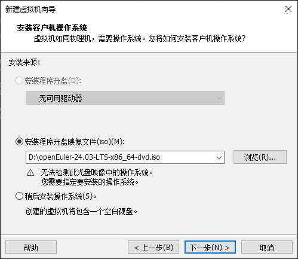
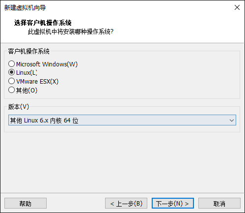
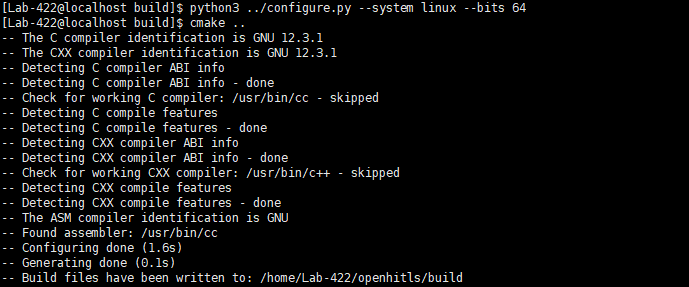
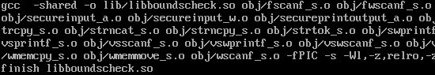
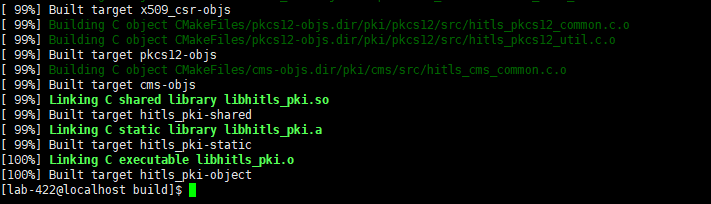
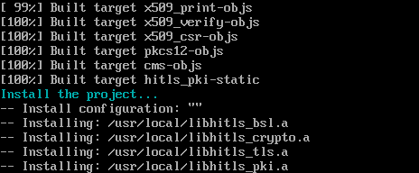

# 一. 下载并构建OpenHiTLS

## 1. 下载并安装openEuler系统
[官方下载地址](https://www.openeuler.org/zh/download/?version=openEuler%2024.03%20LTS)

新建虚拟机时注意以下步骤：
- 选择镜像文件


- 选择linux内核版本



## 2. 构建及安装指导
### a. 准备构建环境
检查系统中构建工具是否已安装，并能正常使用。

| **名称** | **推荐版本** | **说明** |
| --- | --- | --- |
| Gcc | >=7.3.0 | Linux |
| Python | >=3.5 | Linux |
| CMake | >=3.16 | Linux |
| Sctp | 无版本限制 | Linux |

当前openEuler24.03版本系统自带Gcc和Python，CMake和Sctp需要自行安装，查看版本和安装命令如下：
```sh
gcc -v

python3 -v

sudo dnf install cmake
cmake -version

sudo dnf install lksctp*
```
### b. 准备源码

使用git submodule的方式下载，可以直接下载源码和依赖的Securec库，下载命令如下：

```sh
git clone --recurse-submodules https://gitcode.com/openhitls/openhitls.git
```

### c. openHiTLS构建及安装
进入openHiTLS后代码目录结构如下：

```sh
使用tree -L 1查看目录结构，如下：

└── openHiTLS
   ├── bsl
   ├── CMakeLists.txt
   ├── config
   ├── configure.py
   ├── crypto
   ├── docs
   ├── include
   ├── LICENSE
   ├── platform
   ├── README-en.md
   ├── README.md
   ├── script
   ├── testcode
   ├── tls
   └── x509
```

其中：

+ bsl：存放基础功能相关代码；
+ CMakeLists.txt：构建入口文件
+ configure.py：提供构建配置命令行功能；
+ config、script：存放构建相关脚本；
+ crypto：存放密码学算法能力相关代码；
+ platform：存放其他依赖的代码；
+ testcode：存放测试工程类代码。
+ tls：存放安全传输相关代码；
+ x509：存放x509证书功能相关代码；

**源码构建调用CMake进行构建，具体方法下面介绍。**

#### 3.1 CMake构建
openHiTLS提供CMake构建方式，可通过configure.py进行配置，之后建议新建build目录用于存放构建过程中的产生的临时文件，进入build目录使用“cmake .. && make”的方式执行构建。configure.py的配置可以通过`python3 ./configure.py –help`查询。
CMake构建的总体执行步骤如下：
- 创建build文件夹存放生成文件，使用python执行配置文件生成modules.cmake文件。
configure.py脚本会直接基于顶层的compile.json和feature.json配置文件修改已有配置。
```sh
cd openHiTLS
mkdir -p ./build
cd ./build
python3 ../configure.py --system linux --bits 64
```
 python执行结果如下：



- openHiTLS依赖于libboundscheck库，在之前的准备源码阶段已经一并下载。现在进入Secure_C文件夹中编译，生成动态库libboundscheck.so并放到库文件目录下

```sh
cd ../platform/Secure_C
make CC=gcc
sudo cp ./lib/libboundscheck.so /usr/local/lib/
```
make编译结果如下：



- 回到build目录下进行make编译
```sh
cd ../../build
make
```
 make编译结果如下：




构建结果会输出在openHiTLS/build目录下。


#### 3.2 构建结果安装
- 安装openHiTLS的构建结果只需要输入如下命令：

```sh
sudo make install
```
至此，构建完成：




