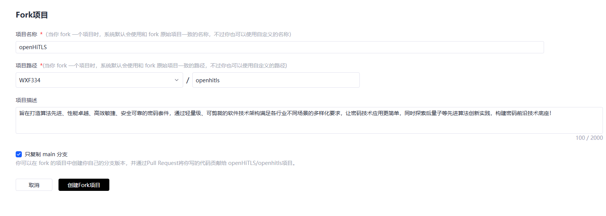
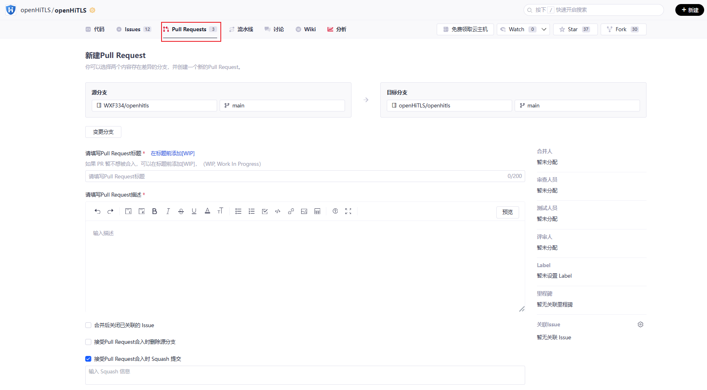

# 为openHiTLS社区做贡献

演示如何向社区提交pr

## 步骤一
点击仓库右上角的fork按钮，复制得到自己的openHiTLS仓库

## 步骤二
将修改的代码push到自己的分支后，点击界面上的pull requests页面，新建pull requests。
标题是对本次修改的概述，描述是本次修改的详细描述。最后一行表示将多次commit消息合并成一条时的commit message

## 步骤三
等待审查人员审核，若仍存在问题，可以继续修改提交，远端pr会自动同步更新，但要注意时刻与原仓库保持同步以及时解决冲突。

