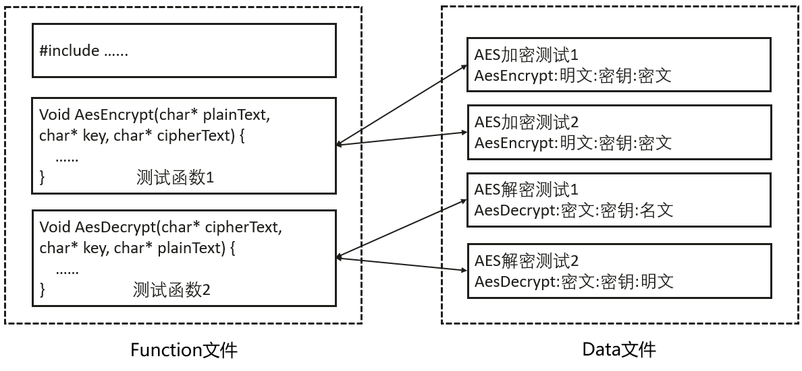
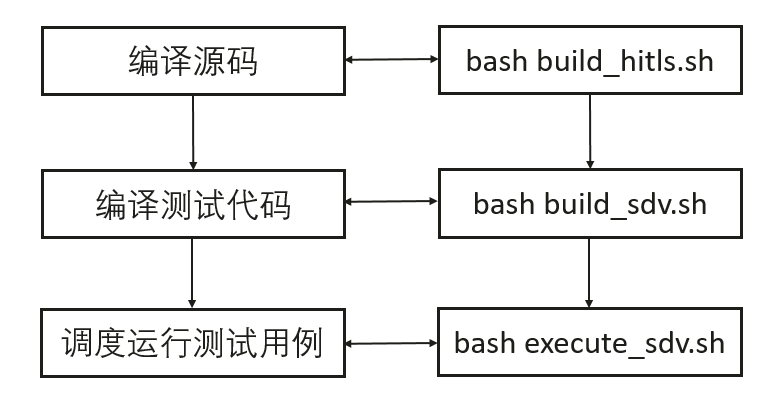
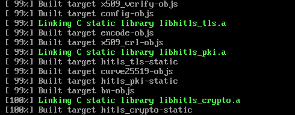
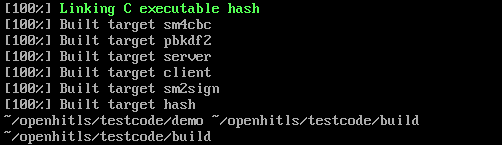
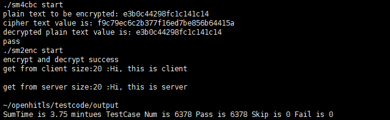

# 测试
测试工程依赖编译源码，参考《构建及安装指导》准备构建源码编译依赖的环境等，确保源码能够得到正确编译。
## 测试代码目录结构
```sh
./testcode/
├── CMakeLists.txt
├── common
│   ├── execute_base.c
│   └── execute_test.c
├── demo
├── framework
│   ├── crypto
│   ├── gen_test
│   ├── include
│   ├── process
│   ├── stub
│   └── tls
├── output
├── script
│   ├── all_mini_test.sh
│   ├── build_hitls.sh
│   ├── build_sdv.sh
│   ├── execute_sdv.sh
│   └── mini_build_test.sh
├── sdv
│   ├── build
│   ├── CMakeLists.txt
│   ├── log
│   ├── report
│   └── testcase
└── testdata
    ├── cert
    └── tls
```

其中：

+ common：公共类测试框架代码
+ demo：openHiTLS功能测试demo
+ framework：openHiTLS测试用例的框架代码
+ output：用例测试结果及过程文件输出目录
+ script：测试脚本类代码目录
+ sdv：openHiTLS功能场景测试用例代码
+ testdata：存放测试类数据等

## 功能测试执行指导
### 1. 测试框架说明
使用社区开发的测试框架，提供公共的配置和方法以便社区开发者进行测试代码的编写和执行。一个测试单元由function文件（.c）和data（.data）文件组成，分别保存测试函数和测试数据。



### 2. 脚本参数说明
| **命令** | **含义** |
| --- | --- |
| bash build_hitls.sh | 编译全量源码。 |
| bash build_sdv.sh | 编译全量测试代码。 |
| bash execute_sdv.sh | 执行测试用例。 |


+ build_hitls.sh脚本参数说明

| **脚本参数** | **执行方式** | **参数说明** |
| --- | --- | --- |
| gcov | bash build_hitls.sh gcov | 开启获取覆盖率能力。 |
| debug | bash build_hitls.sh debug | 开启debug调试能力。 |
| asan | bash build_hitls.sh asan | 开启内存监测能力。 |


+ build_sdv.sh脚本参数说明

| **脚本参数** | **执行方式** | **参数说明** |
| --- | --- | --- |
| --help或-h | bash build_sdv.sh --help | 获取帮助信息。 |
| no-crypto | bash build_sdv.sh no-crypto | 裁剪掉crypto模块用例。 |
| no-bsl | bash build_sdv.sh no-bsl | 裁剪掉bsl模块用例。 |
| verbose | bash build_sdv.sh verbose | 显示构建过程详细信息。 |
| gcov | bash build_sdv.sh gcov | 开启获取覆盖率能力。 |
| asan | bash build_sdv.sh asan | 开启内存监测能力 。 |
| big-endian | bash build_sdv.sh big-endian | 大端环境编译选项。 |
| run-tests | bash build_sdv.sh run-tests=xxx1xxx2xxx3 | 编译指定测试套。 |


+ execute_sdv.sh脚本参数说明

| **脚本参数** | **执行方式** | **参数说明** |
| --- | --- | --- |
| \<file name> | bash execute_sdv.sh test_suites_xxx ... | 执行指定文件下的所有用例。 |
| \<test name> | bash execute_sdv.sh UT_CRYPTO_xxx SDV_CRYPTO_xxx ... | 执行指定用例名用例。 |


备注：脚本参数可以以组合形式传给脚本，例如：

+ 默认方式构建源码：bash build_hitls.sh
+ 源码构建过程中开启asan、debug及覆盖率：bash build_hitls.sh asan gcov debug
+ 测试代码构建过程中开启asan、覆盖率及显示构建详情：bash build_sdv.sh asan gcov verbose
+ 默认方式构建源码：bash build_hitls.sh
+ 默认方式执行全量用例：bash execute_sdv.sh
+ 执行指定的测试集合：bash execute_sdv.sh test_suites_xxx1 test_suites_xxx2

### 3. 用例执行流程
测试工程主要依赖以下脚本：

+ **build_hitls.sh**： 一键式构建源码脚本
+ **build_sdv.sh** ： 一键式构建测试用例脚本
+ **execute_sdv.sh** ： 一键式执行用例脚本 



依次执行以下命令
```sh
cd ../testcode/script/
bash build_hitls.sh
```


```sh
bash build_sdv.sh
```



```sh
bash execute_sdv.sh
```


测试通过