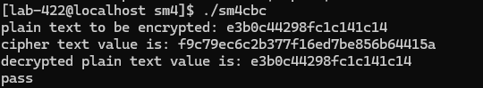
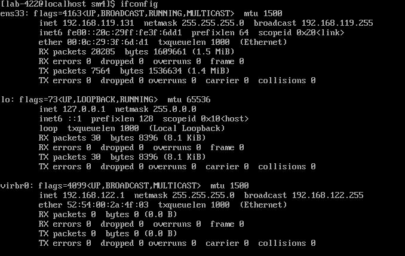
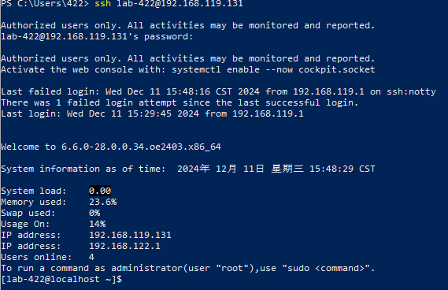
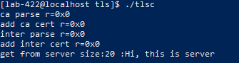
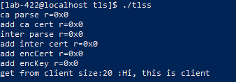

# 在C/C++项目中集成openHiTLS
在本章节中将以对称加密和TLS两个示例演示如何在您的项目代码中调用openHiTLS提供的接口。
## 对称加密实现示例

创建SM4_CBC.c，代码如下：
```c
#include <stdio.h>
#include <stdlib.h>
#include <stdint.h>
#include <string.h>
#include "crypt_eal_cipher.h" // 对称加解密接口头文件
#include "bsl_sal.h"
#include "bsl_err.h"
#include "crypt_algid.h" // 算法id列表
#include "crypt_errno.h" // 错误码列表

void *StdMalloc(uint32_t len) {
    return malloc((size_t)len);
}

void PrintLastError(void) {
    const char *file = NULL;
    uint32_t line = 0;
    BSL_ERR_GetLastErrorFileLine(&file, &line); // 获取错误发生的文件名和行数
    printf("failed at file %s at line %d\n", file, line);
}

int main(void)
{
    uint8_t data[10] = {0xe3, 0xb0, 0xc4, 0x42, 0x98, 0xfc, 0x1c, 0x14, 0x1c, 0x14};
    uint8_t iv[16] = {0};
    uint8_t key[16] = {0};
    uint32_t dataLen = sizeof(data);
    uint8_t cipherText[100];
    uint8_t plainText[100];
    uint32_t outTotalLen = 0;
    uint32_t outLen = sizeof(cipherText);
    uint32_t cipherTextLen;
    int32_t ret;

    printf("plain text to be encrypted: "); // 输出明文
    for (uint32_t i = 0; i < dataLen; i++) {
        printf("%02x", data[i]);
    }
    printf("\n");

    // 初始化错误码模块
    BSL_ERR_Init();

    // BSL_SAL_CallBack_Ctrl
    // 如果未注册并且默认能力没有被裁剪,使用默认linux实现
    BSL_SAL_CallBack_Ctrl(BSL_SAL_MEM_MALLOC_CB_FUNC, StdMalloc);
    BSL_SAL_CallBack_Ctrl(BSL_SAL_MEM_FREE_CB_FUNC, free);

    // 创建上下文
    CRYPT_EAL_CipherCtx *ctx = CRYPT_EAL_CipherNewCtx(CRYPT_CIPHER_SM4_CBC);
    if (ctx == NULL) {
        PrintLastError();
        BSL_ERR_DeInit();
        return 1;
    }
    // 初始化, 最后入参true为加密，false为解密
    ret = CRYPT_EAL_CipherInit(ctx, key, sizeof(key), iv, sizeof(iv), true);
    if (ret != CRYPT_SUCCESS) {
        printf("error code is %x\n", ret); // 输出错误码，可借助错误码在crypt_errno.h中找到对应的错误信息
        PrintLastError();
        goto exit;
    }
    // 设置填充模式。
    ret = CRYPT_EAL_CipherSetPadding(ctx, CRYPT_PADDING_PKCS7);
    if (ret != CRYPT_SUCCESS) {
        printf("error code is %x\n", ret);
        PrintLastError();
        goto exit;
    }

    // 输入待计算数据，该接口可以调用多次。此处outLen输入为cipherText长度，输出为处理的数据量
    ret = CRYPT_EAL_CipherUpdate(ctx, data, dataLen, cipherText, &outLen);
    if (ret != CRYPT_SUCCESS) {
        printf("error code is %x\n", ret);
        PrintLastError();
        goto exit;
    }

    outTotalLen += outLen;                     // 目前已处理数据量
    outLen = sizeof(cipherText) - outTotalLen; // cipherText剩余空间

    // 填充并处理最后一段数据
    ret = CRYPT_EAL_CipherFinal(ctx, cipherText + outTotalLen, &outLen);
    if (ret != CRYPT_SUCCESS) {
        printf("error code is %x\n", ret);
        PrintLastError();
        goto exit;
    }

    outTotalLen += outLen;
    printf("cipher text value is: "); // 输出密文

    for (uint32_t i = 0; i < outTotalLen; i++) {
        printf("%02x", cipherText[i]);
    }
    printf("\n");

    // 开始解密流程
    cipherTextLen = outTotalLen;
    outTotalLen = 0;
    outLen = sizeof(plainText);

    // 初始化, 设置为解密
    ret = CRYPT_EAL_CipherInit(ctx, key, sizeof(key), iv, sizeof(iv), false);
    if (ret != CRYPT_SUCCESS) {
        printf("error code is %x\n", ret); // 输出错误码，可借助错误码在crypt_errno.h中找到对应的错误信息
        PrintLastError();
        goto exit;
    }

    // 设置填充模式，填充模式必须和加密的填充模式相同
    ret = CRYPT_EAL_CipherSetPadding(ctx, CRYPT_PADDING_PKCS7);
    if (ret != CRYPT_SUCCESS) {
        printf("error code is %x\n", ret);
        PrintLastError();
        goto exit;
    }

    // 输入密文数据
    ret = CRYPT_EAL_CipherUpdate(ctx, cipherText, cipherTextLen, plainText, &outLen);
    if (ret != CRYPT_SUCCESS) {
        printf("error code is %x\n", ret);
        PrintLastError();
        goto exit;
    }
    outTotalLen += outLen;                    // 目前已处理数据量
    outLen = sizeof(plainText) - outTotalLen; // buffer剩余空间

    // 解密最后一段数据并去填充
    ret = CRYPT_EAL_CipherFinal(ctx, plainText + outTotalLen, &outLen);
    if (ret != CRYPT_SUCCESS) {
        printf("error code is %x\n", ret);
        PrintLastError();
        goto exit;
    }

    outTotalLen += outLen;

    printf("decrypted plain text value is: "); // 输出明文
    for (uint32_t i = 0; i < outTotalLen; i++) {
        printf("%02x", plainText[i]);
    }
    printf("\n");

    if (outTotalLen != dataLen || memcmp(plainText, data, dataLen) != 0) {
        printf("plaintext comparison failed\n");
        goto exit;
    }
    printf("pass \n");

exit:
    // 释放上下文内存
    CRYPT_EAL_CipherFreeCtx(ctx);
    BSL_ERR_DeInit();
    return ret;
}


```

在同目录下创建Makefile文件，内容如下：

```sh
OPEN_PATH=openhitls
USER=lab-422
BUILD=build
LINK_FLAGS=-pthread -lhitls_tls -lhitls_pki -lhitls_crypto -lhitls_bsl -lboundscheck -lsctp
LIB=-L /home/$(USER)/$(OPEN_PATH)/$(BUILD) -Wl,-rpath,/home/$(USER)/$(OPEN_PATH)/$(BUILD) -Wl,-rpath,/usr/local/lib/
HEADER=-I/home/$(USER)/$(OPEN_PATH)/include/crypto -I/home/$(USER)/$(OPEN_PATH)/include/bsl -I/home/$(USER)/$(OPEN_PATH)/include/tls -I/home/$(USER)/$(OPEN_PATH)/include/pki -I/home/$(USER)/$(OPEN_PATH)/platform/Secure_C/include

all:sm4

sm4:
	gcc $(HEADER) SM4_CBC.c -g -o sm4cbc $(LINK_FLAGS) $(LIB)

clean:
	rm sm4cbc
```

注意把USER字段改成自己系统的用户名，确定头文件路径和链接库路径正确。
编译生成可执行文件sm4cbc并运行

```sh
make
./sm4cbc
```
示例运行成功




## TLS实现示例

由于TLS需要同时运行server和client两个程序，而openEuler没有图形化操作界面操作不便，现介绍用PowerShell实现打开多个终端界面。
首先在openEuler系统中查看ip
```sh
ifconfig
```


可以看到ip地址为192.168.119.131

在windows中打开PowerShell，输入以下命令，然后输入密码
```sh
ssh lab-422@192.168.119.131
```
连接成功



接下来开始实现tls示例。
创建tlss.c和tlsc.c，代码如下，注意修改CERT_PATH的路径：

```c
// 基于证书认证的TLS客户端
#include <stdio.h> 
#include <stdlib.h> 
#include <arpa/inet.h>
#include <unistd.h>
#include <string.h>
#include "bsl_sal.h" 
#include "bsl_err.h" 
#include "hitls_error.h" 
#include "hitls_config.h" 
#include "hitls.h" 
// #include "hitls_x509.h"
#include "hitls_cert.h"
#include "hitls_cert_init.h"

#include "hitls_crypt_init.h"

#include "crypt_eal_rand.h"
#include "crypt_eal_encode.h"

#define HTTP_BUF_MAXLEN (18 * 1024)  /* 18KB */ 
#define CERT_PATH "/home/lab-422/openhitls/testcode/testdata/tls/certificate/der/rsa_sha256/"

int TCP_Connect(const char* ip, const char* port, struct sockaddr_in* sockAddr) {
    int sockfd = socket(AF_INET, SOCK_STREAM, 0);
    if (sockfd == -1) {
        perror("socket");
        return -1;
    }

    memset(sockAddr, 0, sizeof(struct sockaddr_in));
    sockAddr->sin_family = AF_INET;
    sockAddr->sin_port = htons(atoi(port));
    if (inet_pton(AF_INET, ip, &(sockAddr->sin_addr)) <= 0) {
        perror("inet_pton");
        close(sockfd);
        return -1;
    }

    if (connect(sockfd, (struct sockaddr*)sockAddr, sizeof(struct sockaddr_in)) == -1) {
        perror("connect");
        close(sockfd);
        return -1;
    }

    return sockfd;
}

void TCP_Close(int fd) {
    close(fd);
}

int main(int32_t argc, char *argv[]) 
{ 
    int32_t exitValue = -1; 
    int32_t ret = 0; 
    HITLS_Config *config = NULL; 
    HITLS_Ctx *ctx = NULL; 
    BSL_UIO *uio = NULL; 

    /* 注册BSL内存能力、仅供参考 */ 
    BSL_SAL_CallBack_Ctrl(BSL_SAL_MEM_MALLOC_CB_FUNC, malloc);
    BSL_SAL_CallBack_Ctrl(BSL_SAL_MEM_FREE_CB_FUNC, free);
    BSL_ERR_Init();

    HITLS_CertMethodInit();
    CRYPT_EAL_RandInit(CRYPT_RAND_SHA256, NULL, NULL, NULL, 0);
    HITLS_CryptMethodInit();

    /* TCP链接需用户实现能力 */
    struct sockaddr_in sockAddr; 
    int fd = TCP_Connect("127.0.0.1", "12345", &sockAddr); 
    if (fd < 0) { 
        printf("SCTP_Connect failed.\n"); 
        return -1; 
    } 

    config = HITLS_CFG_NewTLSConfig(); 
    if (config == NULL) { 
        printf("HITLS_CFG_NewTLS12Config failed.\n"); 
        return -1; 
    } 
    HITLS_CFG_SetCheckKeyUsage(config,false);
    HITLS_CFG_SetFlightTransmitSwitch(config,true);
    /* 加载证书：需要用户实现 */ 
    int r=0;
    HITLS_CERT_X509 *ca_cert = NULL;
    r = HITLS_X509_CertParseFile(TLS_PARSE_FORMAT_PEM,
                                CERT_PATH"ca.der",
                                &ca_cert);
    printf("ca parse r=0x%x\n", r);
    r = HITLS_CFG_AddCertToStore(config, ca_cert, TLS_CERT_STORE_TYPE_DEFAULT,
                                false);
    printf("add ca cert r=0x%x\n", r);

    HITLS_CERT_X509 *inter_cert = NULL;
    r = HITLS_X509_CertParseFile(TLS_PARSE_FORMAT_PEM,
                                CERT_PATH"inter.der",
                                &inter_cert);
    printf("inter parse r=0x%x\n", r);
    r = HITLS_CFG_AddCertToStore(config, inter_cert, TLS_CERT_STORE_TYPE_DEFAULT,
                                false);
    printf("add inter cert r=0x%x\n", r);
    // r=HITLS_CFG_LoadCertFile(config, "/home/ling/ca_server.crt", TLS_CERT_STORE_TYPE_DEFAULT);
    // printf("add encCert r=0x%x\n", r);
    /* 新建openHiTLS上下文 */ 
    ctx = HITLS_New(config); 
    if (ctx == NULL) { 
        printf("HITLS_New failed.\n"); 
        goto exit; 
    } 

    /* 用户可按需实现method */ 
    uio = BSL_UIO_New(BSL_UIO_TcpMethod()); 
    if (uio == NULL) { 
        printf("BSL_UIO_New failed.\n"); 
        goto exit; 
    } 

    ret = BSL_UIO_Ctrl(uio, BSL_UIO_SET_FD, (int32_t)sizeof(fd), &fd); 
    if (ret != HITLS_SUCCESS) { 
        BSL_UIO_Free(uio); 
        printf("BSL_UIO_SET_FD failed, fd = %u.\n", fd); 
        goto exit; 
    } 

    ret = HITLS_SetUio(ctx, uio); 
    if (ret != HITLS_SUCCESS) { 
        BSL_UIO_Free(uio); 
        printf("HITLS_SetUio failed. ret = 0x%x.\n", ret); 
        goto exit; 
    } 

    /* 进行TLS连接、用户需按实际场景考虑返回值 */ 
    ret = HITLS_Connect(ctx); 
    if (ret != HITLS_SUCCESS) { 
        printf("HITLS_Connect failed, ret = 0x%x.\n", ret); 
        goto exit; 
    } 

    /* 向对端发送报文、用户需按实际场景考虑返回值 */ 
    const uint8_t sndBuf[] = "Hi, this is client\n"; 
    ret = HITLS_Write(ctx, sndBuf, sizeof(sndBuf), &ret); 
    if (ret != HITLS_SUCCESS) { 
        printf("HITLS_Write error:error code:%d\n", ret); 
        goto exit; 
    } 

    /* 读取对端报文、用户需按实际场景考虑返回值 */ 
    uint8_t readBuf[HTTP_BUF_MAXLEN + 1] = {0}; 
    uint32_t readLen = 0; 
    ret = HITLS_Read(ctx, readBuf, HTTP_BUF_MAXLEN, &readLen); 
    if (ret != HITLS_SUCCESS) { 
        printf("HITLS_Read failed, ret = 0x%x.\n", ret); 
        goto exit; 
    } 

    printf("get from server size:%u :%s\n", readLen, readBuf); 

    exitValue = 0; 
exit: 
    HITLS_Close(ctx); 
    HITLS_Free(ctx); 
    HITLS_CFG_FreeConfig(config); 
    TCP_Close(fd); 
    return exitValue; 
}

```


```c
//基于证书认证的TLS服务端
#define HITLS_CRYPTO_EAL
#define HITLS_CRYPTO_CIPHER
#include <stdio.h> 
#include <string.h>
#include <unistd.h>
#include <sys/socket.h>
#include <netinet/in.h>
#include <stdlib.h> 
#include <arpa/inet.h>
#include "bsl_sal.h" 
#include "bsl_err.h" 
#include "hitls_error.h" 
#include "hitls_config.h" 
#include "hitls.h" 
// #include "hitls_x509.h"
#include "hitls_cert.h"
#include "hitls_cert_init.h"

#include "hitls_crypt_init.h"

#include "crypt_eal_rand.h"
#include "crypt_eal_encode.h"

#define HTTP_BUF_MAXLEN (18 * 1024)  /* 18KB */ 
#define CERT_PATH "/home/lab-422/openhitls/testcode/testdata/tls/certificate/der/rsa_sha256/"
int TCP_Bind(const char* port) {
    int sockfd;
    struct sockaddr_in serverAddr;

    // 创建套接字
    sockfd = socket(AF_INET, SOCK_STREAM, 0);
    if (sockfd == -1) {
        perror("socket creation failed");
        return -1;
    }

    // 设置服务器地址信息
    memset(&serverAddr, 0, sizeof(serverAddr));
    serverAddr.sin_family = AF_INET;
    serverAddr.sin_addr.s_addr = INADDR_ANY;
    serverAddr.sin_port = htons(atoi(port));

    // 绑定套接字到指定端口
    if (bind(sockfd, (struct sockaddr*)&serverAddr, sizeof(serverAddr)) == -1) {
        perror("bind failed");
        close(sockfd);
        return -1;
    }

    // 开始监听连接请求
    if (listen(sockfd, 10) == -1) {
        perror("listen failed");
        close(sockfd);
        return -1;
    }

    return sockfd;
}

int TCP_Accept(int listenFd, struct sockaddr_in* clientAddr) {
    int clientFd;
    socklen_t clientAddrLen;
    struct sockaddr_in addr;

    // 等待客户端连接请求
    clientAddrLen = sizeof(struct sockaddr_in);
    clientFd = accept(listenFd, (struct sockaddr*)&addr, &clientAddrLen);
    if (clientFd == -1) {
        perror("accept failed");
        return -1;
    }

    // 将客户端地址信息保存到clientAddr中
    memcpy(clientAddr, &addr, sizeof(struct sockaddr_in));

    return clientFd;
}

void TCP_Close(int fd) {
    close(fd);
}

int main(int32_t argc, char *argv[]) 
{ 
    int32_t exitValue = -1; 
    int32_t ret = 0; 
    HITLS_Config *config = NULL; 
    HITLS_Ctx *ctx = NULL; 
    BSL_UIO *uio = NULL; 

    /* 注册BSL内存能力、仅供参考 */ 
    BSL_SAL_CallBack_Ctrl(BSL_SAL_MEM_MALLOC_CB_FUNC, malloc);
    BSL_SAL_CallBack_Ctrl(BSL_SAL_MEM_FREE_CB_FUNC, free);
    BSL_ERR_Init();

    HITLS_CertMethodInit();
    CRYPT_EAL_RandInit(CRYPT_RAND_SHA256, NULL, NULL, NULL, 0);
    HITLS_CryptMethodInit();
    /* TCP链接需用户实现能力 */
    int listenFd = TCP_Bind("12345");  
    struct sockaddr_in sockAddr;  
    int fd = TCP_Accept(listenFd, &sockAddr);  
    if (fd < 0) {  
        printf("TCP_Accept failed.\n");  
        return -1;  
    }

    config = HITLS_CFG_NewTLSConfig(); 
    if (config == NULL) { 
        printf("HITLS_CFG_NewTLS12Config failed.\n"); 
        return -1; 
    } 
    HITLS_CFG_SetCheckKeyUsage(config,false);
    HITLS_CFG_SetFlightTransmitSwitch(config,true);
    /* 加载证书：需要用户实现 */ 
    int r=0;
    HITLS_CERT_X509 *ca_cert = NULL;
    r = HITLS_X509_CertParseFile(TLS_PARSE_FORMAT_PEM,
                                CERT_PATH"ca.der",
                                // "/home/ling/ca_server.crt"
                                &ca_cert);
    printf("ca parse r=0x%x\n", r);
    r = HITLS_CFG_AddCertToStore(config, ca_cert, TLS_CERT_STORE_TYPE_DEFAULT,
                                false);
    printf("add ca cert r=0x%x\n", r);

    HITLS_CERT_X509 *inter_cert = NULL;
    r = HITLS_X509_CertParseFile(TLS_PARSE_FORMAT_PEM,
                                CERT_PATH"inter.der",
                                &inter_cert);
    printf("inter parse r=0x%x\n", r);
    r = HITLS_CFG_AddCertToStore(config, inter_cert, TLS_CERT_STORE_TYPE_DEFAULT,
                                false);
    printf("add inter cert r=0x%x\n", r);

    // 从文件中加载加密证书和私钥    
    r=HITLS_CFG_LoadCertFile(config, CERT_PATH"server.der", TLS_PARSE_FORMAT_ASN1);
    printf("add encCert r=0x%x\n", r);
    r=HITLS_CFG_LoadKeyFile(config, CERT_PATH"server.key.der", TLS_PARSE_FORMAT_ASN1);
    printf("add encKey r=0x%x\n", r);
    
    /* 新建openHiTLS上下文 */ 
    ctx = HITLS_New(config); 
    if (ctx == NULL) { 
        printf("HITLS_New failed.\n"); 
        goto exit; 
    } 

    /* 用户可按需实现method */ 
    uio = BSL_UIO_New(BSL_UIO_TcpMethod()); 
    if (uio == NULL) { 
        printf("BSL_UIO_New failed.\n"); 
        goto exit; 
    } 

    ret = BSL_UIO_Ctrl(uio, BSL_UIO_SET_FD, (int32_t)sizeof(fd), &fd); 
    if (ret != HITLS_SUCCESS) { 
        BSL_UIO_Free(uio); 
        printf("BSL_UIO_SET_FD failed, fd = %u.\n", fd); 
        goto exit; 
    } 

    ret = HITLS_SetUio(ctx, uio); 
    if (ret != HITLS_SUCCESS) { 
        BSL_UIO_Free(uio); 
        printf("HITLS_SetUio failed. ret = 0x%x.\n", ret); 
        goto exit; 
    } 

    /* 进行TLS连接、用户需按实际场景考虑返回值 */ 
    ret = HITLS_Accept(ctx); 
    if (ret != HITLS_SUCCESS) { 
        printf("HITLS_Accept failed, ret = 0x%x.\n", ret); 
        goto exit; 
    } 

    /* 读取对端报文、用户需按实际场景考虑返回值 */ 
    uint8_t readBuf[HTTP_BUF_MAXLEN + 1] = {0}; 
    uint32_t readLen = 0; 
    ret = HITLS_Read(ctx, readBuf, HTTP_BUF_MAXLEN, &readLen); 
    if (ret != HITLS_SUCCESS) { 
        printf("HITLS_Read failed, ret = 0x%x.\n", ret); 
        goto exit; 
    } 
    printf("get from client size:%u :%s\n", readLen, readBuf); 

    /* 向对端发送报文、用户需按实际场景考虑返回值 */ 
    const uint8_t sndBuf[] = "Hi, this is server\n"; 
    ret = HITLS_Write(ctx, sndBuf, sizeof(sndBuf), &ret); 
    if (ret != HITLS_SUCCESS) { 
        printf("HITLS_Write error:error code:%d\n", ret); 
        goto exit; 
    }
    exitValue = 0; 
exit: 
    HITLS_Close(ctx); 
    HITLS_Free(ctx); 
    HITLS_CFG_FreeConfig(config); 
    TCP_Close(fd); 
    return exitValue; 
}
```
在同目录下创建Makefile文件，内容如下：
```sh
OPEN_PATH=openhitls
BUILD=build
USER=lab-422
LINK_FLAGS=-pthread -lhitls_tls -lhitls_pki -lhitls_crypto -lhitls_bsl -lboundscheck -lsctp
LIB=-L /home/$(USER)/$(OPEN_PATH)/$(BUILD) -Wl,-rpath,/home/$(USER)/$(OPEN_PATH)/$(BUILD) -Wl,-rpath,/usr/local/lib/
HEADER=-I/home/$(USER)/$(OPEN_PATH)/include/crypto -I/home/$(USER)/$(OPEN_PATH)/include/bsl -I/home/$(USER)/$(OPEN_PATH)/include/tls -I/home/$(USER)/$(OPEN_PATH)/include/pki -I/home/$(USER)/$(OPEN_PATH)/platform/Secure_C/include

all:tls

tls:
	gcc $(HEADER) tlss.c -g -o tlss $(LINK_FLAGS) $(LIB)
	gcc $(HEADER) tlsc.c -g -o tlsc $(LINK_FLAGS) $(LIB)

clean:
	rm tlss tlsc

```

输入make，并运行tls服务端
```sh
make
./tlss
```

启动一个新的PowerShell窗口，ssh连接到openEuler系统，运行tls服务端
```sh
./tlsc
```

可以看到两个窗口都有输出，示例运行成功



